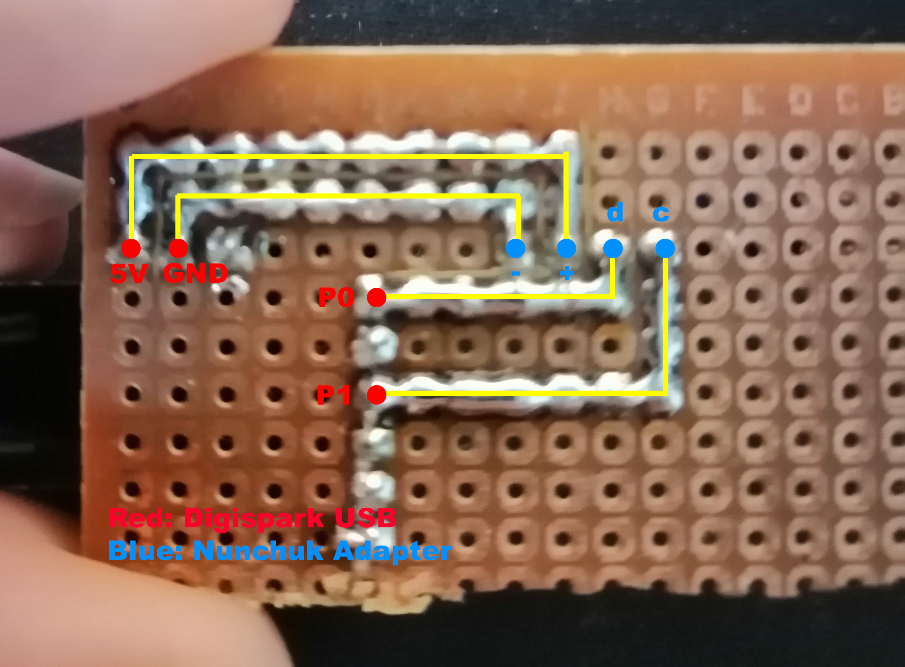
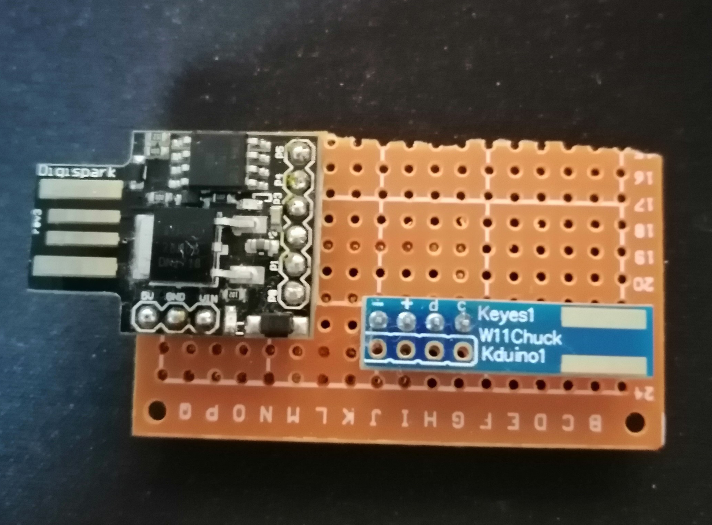
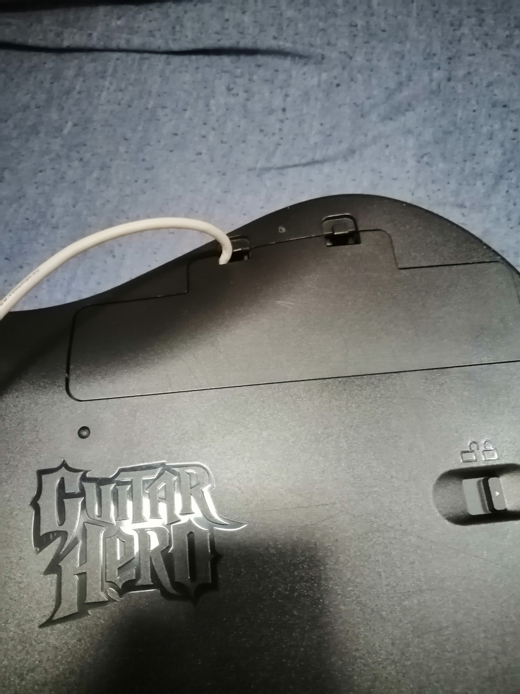
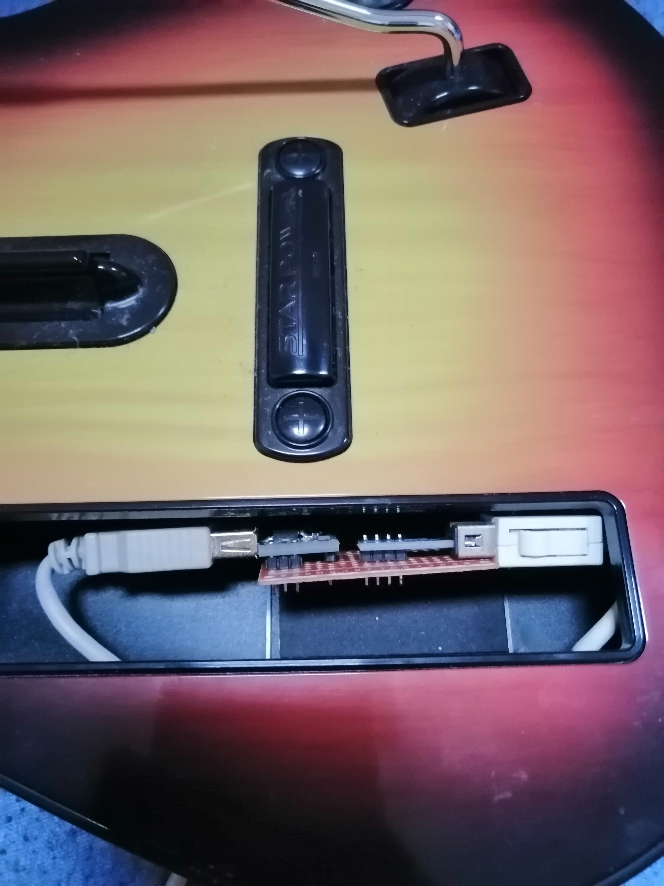

# Wiitar
Guide + Code for a wii guitar to USB adapter.
This uses a Digispark USB with a special wii guitar lib that works with TinyWireM.

Inspired by [WiiHero](https://github.com/jkctech/WiiHero)

## How to use
Requirements:
- Wii-compatible Guitar Hero Guitar
- Digispark USB
- Wii Nunchuk Adapter Module
- Usb Extension Cable
- A Breadboard or a soldering PCB

### Step 1.
Solder your Digispark and Nunchuk module to your PCB or connect them via your Breadboard.

### Step 2.
Connect your Digispark USB to your PC and flash Wiitar.ino to it.

### Step 3.
Connect the nunchuk module to your nunchuk and attach the USB Extension cord.

### (Optional) Step 4.
Configure your buttons via Clone Hero.

## Why use this?
It's a way cheaper approach than buying a pre-built adapter if you're not afraid to get your hands dirty.

A RaphNet adapter is $30.

This project costs
- Digispark USB: $1
- Wii Nunchuk module: $0.20
- USB Extension Cable: $2

Which means it'd only cost you about $3.20 to build your own adapter. Of course, I used chinese knockoffs but it WORKS and it's CHEAP :)

## Finished Product

